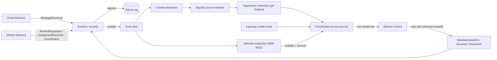

# The Second Slice: A Structurally Different Source

> Status: Implemented · Owner: @asbillings07 · Last updated: 2026-07-21
> Related issues: #44 GitHub Skill Contract · #45 GitHub Understanding · #46 Cross-source Prioritization · builds on the [First Vertical Slice](./vertical-slice.md) and ADRs [0002](../adr/0002-everything-is-an-event.md), [0004](../adr/0004-ai-recommends-rules-decide.md), [0005](../adr/0005-context-is-a-first-class-domain-object.md), [0007](../adr/0007-event-driven-architecture.md), [0008](../adr/0008-event-bus.md), [0009](../adr/0009-storage-strategy.md), [0010](../adr/0010-skill-architecture.md), [0011](../adr/0011-ai-abstraction-layer.md), and the new [0012](../adr/0012-attention-is-a-projection-distinct-from-context.md)

**The purpose of the second slice is to prove the architecture generalizes — that a source which is nothing like email flows through the same backbone with no special cases.** The [First Vertical Slice](./vertical-slice.md) proved one full pass through the [Decision Loop](../domain/mental-model.md) with Gmail. One source can always be made to fit; the real question is whether the *second* one fits without bending the domain around either. GitHub is deliberately unlike Gmail: its actionable facts are reviews, assignments, and failing checks — not messages in a thread — and they attach to persistent things (a PR, an issue, a check run) rather than to a conversation.

Like the first slice, it runs with **no API key and no network**: GitHub is fixtures-first behind the same Source seam, and the default AI is a deterministic stub.

## What it proves

| ADR | How the second slice proves (or extends) it |
| --- | --- |
| [0010](../adr/0010-skill-architecture.md) Skill architecture | The GitHub Skill joins Orion **purely as a Skill** — it declares a manifest, stamps its `source`, and reaches the rest of Orion only through domain events. The domain never learns GitHub exists, exactly as it never learned Gmail exists. |
| [0002](../adr/0002-everything-is-an-event.md) Everything is an Event | A second, structurally different source produces the same kind of immutable, frozen Events (`ReviewRequested`, `AssignmentReceived`, `CheckFailed`). Event ids are occurrence-based, so re-ingest is idempotent while two occurrences on one entity stay distinct. |
| [0007](../adr/0007-event-driven-architecture.md) / [0008](../adr/0008-event-bus.md) Event-driven / Bus | The GitHub Skill and the Gmail Skill never call each other; they cooperate only by publishing to the same bus. Adding the second source added zero coupling between sources. |
| [0009](../adr/0009-storage-strategy.md) Storage | Both sources append to the same log; every projection (Context, **Attention**) is rebuildable from it. |
| [0005](../adr/0005-context-is-a-first-class-domain-object.md) Context first-class | Context folds GitHub facts into source-neutral collaborative-work state, queried independently of any prompt. |
| [0004](../adr/0004-ai-recommends-rules-decide.md) AI advises, rules decide | Ranking across *both* sources and every explanation stay deterministic; AI only adds an advisory summary. |
| [0011](../adr/0011-ai-abstraction-layer.md) AI abstraction | Unchanged — the second source needed nothing new from the AI layer. |
| **[0012](../adr/0012-attention-is-a-projection-distinct-from-context.md) Attention is a projection** | **New.** The second source forced the split of *what is true* (Context) from *the user's relationship to a Work Item* (Attention). See [Deviations](#deviations-what-the-second-source-forced) below. |

## The pipeline (what changed, and what didn't)



The backbone is unchanged from the first slice. Two things are new: a **second producer** on the left, and a **second projection** (Attention) fed by the same bus. Everything between them — Context, Signals, Opportunity, Capacity, Prioritization, Mission Control — became *source-neutral* rather than gaining GitHub-specific branches.

## ADR-to-code mapping (the GitHub slice)

| Stage | Code | Notes |
| --- | --- | --- |
| Declare | `packages/github-skill/src/skill.ts` (`githubManifest`) | `produces: [ReviewRequested, AssignmentReceived, CheckFailed]`, `satisfies SkillManifest` keeps it honest against core's vocabulary. |
| Ingest behind a seam | `packages/github-skill/src/source.ts` (`GitHubSource`, `FixtureGitHubSource`) | Fixtures by default; a live adapter drops in behind the same interface ([#49](https://github.com/asbillings07/AI-OS/issues/49), now Integrations work). |
| Normalize (vendor stops here) | `packages/github-skill/src/normalize.ts` | Non-actionable activity is dropped at the boundary (silence). Bringing your own Source *requires* an explicit identity — the type forbids silently reusing the fixture identity. |
| Understand | `packages/core/src/understanding/context.ts`, `work-signals.ts`, `work-opportunities.ts` | Folds GitHub facts into collaborative-work Context; derives `PendingReview`, `Assigned`, `CheckFailing`, `Commitment`, `Aging`; produces `review` / `assignment` / `check` Opportunities. |
| Address by identity | `packages/core/src/subject/index.ts` (`SubjectRef`, `subjectKey`) | A source-neutral reference to the persistent thing an Opportunity is about. |
| Attention | `packages/core/src/attention/{projection,visibility,revision}.ts` | Suppression, snooze, and revision-scoped actions across every Subject kind (ADR-0012). |
| Prioritize | `packages/core/src/prioritization/index.ts` | One ranked list across both sources; `WorkItem` is a discriminated union over Subject kind; ids are globally unique (`wi-${subjectKey}`). |
| Surface + act | `apps/mission-control/lib/orion.ts`, `apps/mission-control/app/page.tsx`, `apps/mission-control/app/actions.ts` | Actions carry an `attentionRevision` token validated server-side. |

## Deviations: what the second source forced

The first slice's abstractions were shaped, unavoidably, by a single source whose actionable unit is a *message in a thread*. The second source revealed where those abstractions were secretly email-shaped. Each of the following is a change the core had to *learn*, not a patch around GitHub:

1. **A Subject abstraction (`SubjectRef`).** Gmail actions targeted a `threadId`; GitHub Work Items are about a PR, an issue, or a check run. The identity of "the persistent thing this Opportunity is about" was extracted into a source-neutral `SubjectRef` (`{ kind, id }`) living in a neutral `@orion/core` module — so `domain` can reference it without depending on `understanding`. A new architecture-fitness rule now enforces "domain does not import the understanding layer."

2. **Attention became its own projection (ADR-0012).** In the first slice, "have I handled this?" was folded into Context and gated inside `detectSignals` (a handled/snoozed thread produced no Signal). That conflated *what is true* with *the user's relationship to it*, and it only knew how to mute threads. The second source forced the split: `detectSignals` now always describes reality, and a separate **Attention projection** owns suppression, snooze, and dismissal for *any* Subject kind. This is the single largest change the second source produced, and it is documented in [ADR-0012](../adr/0012-attention-is-a-projection-distinct-from-context.md).

3. **Actions are revision-scoped, not thread-scoped.** A GitHub Work Item can change underneath the user (a new commit, a fresh review request) between render and click. The action *request* now carries an `attentionRevision` token — derived from the Subject plus the sorted `attentionBasisEventIds` (usually just the current occurrence, not the full evidence/provenance set) — that the server recomputes from the currently-visible Work Item and records only on a match. The recorded event then carries the server-validated basis, not the token. This closed a time-of-check/time-of-use race that the single-source slice never exposed. (Atomic check-and-record / request-level idempotency is the remaining hardening, tracked in [#61](https://github.com/asbillings07/AI-OS/issues/61).)

4. **"Latest" means occurrence time, not append order.** Revision correctness required that the "current" evidence for a Subject be chosen by domain timestamp (with event id as a deterministic tie-break), not by the order events happened to land in the log. `ThreadContext` now tracks `latestMessageEventId` accordingly.

5. **Work Item identity had to be globally unique across Subject kinds.** Ids are now `wi-${subjectKey(subject)}` for every kind, so a `review` and a `thread` can never collide.

6. **Capacity became source-neutral.** It previously counted open Gmail threads; it now measures *visible attention demand* (`activeWorkCount`) regardless of where the work came from — otherwise GitHub load would have been invisible to the attention bar.

7. **Prioritization stopped reaching into Context.** Opportunities now carry their own presentation (`title`, `location`, `url`), so ranking is self-contained and never reads Context for display — a boundary the first slice tolerated because there was only one shape to look up.

8. **Deterministic ordinal tie-breaks.** Cross-source ranking made tie-breaks visible across environments; `localeCompare` was replaced with a portable `compareOrdinal`.

## Architecture changes required

Not "none required" — but notably, **every change was additive or a generalization, and none broke the event backbone.** No ADR from the first slice was reversed. One new ADR ([0012](../adr/0012-attention-is-a-projection-distinct-from-context.md)) was written, one new source-neutral concept (`SubjectRef`) was introduced, and one new fitness rule was added. The Event → Context → Signal → Opportunity → Work Item chain, the bus, and the storage model all held. That is the result the second slice was designed to test.

## Explainability without AI — still holds

The [ADR-0004](../adr/0004-ai-recommends-rules-decide.md) acceptance criterion survives cross-source ranking: *"Why is this here?"* is answered entirely by deterministic reasoning for both Gmail and GitHub items — the same Event → Context → Signal → Opportunity → Work Item chain, plus each Work Item's `reason`, `evidence`, and `createdFromEventIds`. A GitHub item and a Gmail item can be compared on the same ranked list with a traceable reason for each. Enforced by tests.

## The next domain trigger: cross-source correlation

The second slice deliberately stops **one step short of correlation.** Today the two sources are ranked together but treated as independent Subjects. The obvious real-world case — an automated GitHub *email* that duplicates a structured GitHub *event* — is handled only by coarse automated-notification suppression: the automated email is normalized and recorded like any other message, but later `detectSignals` recognizes the automated sender and Opportunity detection emits nothing for it, so only the structured event surfaces. That is a stopgap, not correlation.

True **cross-source correlation** — recognizing that a Gmail notification and a GitHub event refer to *the same underlying Subject* and collapsing them into one Work Item with merged evidence — is the next domain trigger. It is deferred deliberately: it needs a way to express identity *across* sources (a correlation key or Subject aliasing), and forcing that design now, from two sources, would risk baking in another single-source-shaped assumption. When a third signal for the same Subject appears, that is the trigger to design it properly.

## Running it

```bash
npm install          # Node 24 LTS (see .nvmrc)
npm test             # deterministic; no network, no keys — both sources
npm run slice        # the whole loop, now with Gmail + GitHub
npm --workspace @orion/mission-control run dev   # Mission Control at localhost:3000
```

Mission Control boots fixture Gmail **and** fixture GitHub today. Wiring real, live sources for dogfooding is the [v0.1 Dogfood](https://github.com/asbillings07/AI-OS/milestone/10) milestone, not architecture work.

## Related documents

- [The First Vertical Slice](./vertical-slice.md) — the single-source pass this slice generalizes
- [ADR-0012: Attention is a projection distinct from Context](../adr/0012-attention-is-a-projection-distinct-from-context.md) — the decision the second source forced
- [Prioritization Engine](./prioritization-engine.md) · [Capacity](./capacity.md) · [Understanding Engine](./understanding-engine.md)
- [Ubiquitous Language](../domain/ubiquitous-language.md) — Subject, Attention Disposition, Opportunity
