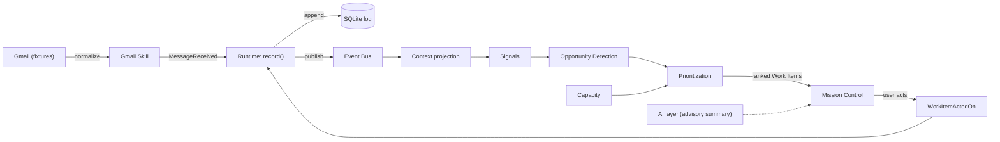

# The First Vertical Slice

> Status: Implemented · Owner: @asbillings07 · Last updated: 2026-07-19
> Related issues: #18 First vertical slice · builds on ADRs [0002](../adr/0002-everything-is-an-event.md), [0004](../adr/0004-ai-recommends-rules-decide.md), [0005](../adr/0005-context-is-a-first-class-domain-object.md), [0007](../adr/0007-event-driven-architecture.md), [0008](../adr/0008-event-bus.md), [0009](../adr/0009-storage-strategy.md), [0010](../adr/0010-skill-architecture.md), [0011](../adr/0011-ai-abstraction-layer.md)

**The purpose of this slice is architectural validation, not features.** It is one complete pass through the [Decision Loop](../domain/mental-model.md) — a Gmail message becomes an Event, flows through the Understanding Engine into a ranked, explained Work Item in Mission Control, and a user action feeds a new Event back in. If the code follows the ADRs without exceptions, the foundation is proven. Where it fights us, the docs get fixed — not patched around.

It runs with **no API key and no network**: Gmail is fixtures-first, and the default AI is a deterministic stub.

## What it exercises

| ADR | How this slice proves it |
| --- | --- |
| [0002](../adr/0002-everything-is-an-event.md) Everything is an Event | Every fact — inbound message, user action — is an immutable, frozen Event |
| [0007](../adr/0007-event-driven-architecture.md) Event-driven | Components cooperate *across boundaries* by reacting to events, not by calling each other; ordinary function calls remain fine *within* a bounded component |
| [0008](../adr/0008-event-bus.md) Event Bus | One in-process bus; `publish`/`subscribe`/`replay` deliver identically |
| [0009](../adr/0009-storage-strategy.md) Storage | SQLite append-only log is the only source of truth; Context is a rebuildable projection |
| [0005](../adr/0005-context-is-a-first-class-domain-object.md) Context first-class | Context is derived from events, queried independently of any prompt |
| [0010](../adr/0010-skill-architecture.md) Skill architecture | The Gmail Skill reaches Orion only through events; the domain never learns Gmail exists |
| [0011](../adr/0011-ai-abstraction-layer.md) AI abstraction | All AI goes through one capability layer; the default provider is deterministic |
| [0004](../adr/0004-ai-recommends-rules-decide.md) AI advises, rules decide | Ranking and every explanation are deterministic; AI only adds an advisory summary |

## The pipeline



The final arrow is the point: a human decision produces a new Event at the beginning, and the loop runs again.

## Stage-by-stage

1. **Ingest (`packages/gmail-skill`).** `GmailSkill.ingest` fetches Gmail-shaped messages from a `GmailSource` (fixtures by default, `LiveGmailSource` behind the same seam), normalizes each into a domain `MessageReceived` payload, and records it. The event id is derived from the message id, so re-ingesting is idempotent. The vendor shape stops in the adapter (Eng #8).
2. **Record (`packages/core` runtime).** `record()` appends the event to the SQLite log, then publishes it on the bus. The log is truth; everything else is derived.
3. **Understand (`packages/core/understanding`).** The Context projection folds events into threads and people, so Relationships (who you correspond with) emerge. `detectSignals` derives meaning deterministically — `AwaitingReply`, `DirectQuestion`, `FromKnownPerson`, `Aging`, `LikelyLowValue` — each carrying its own evidence and source event ids.
4. **Detect Opportunity (`packages/core/opportunity`).** A thread awaiting a reply becomes a `ReplyNeeded` Opportunity ("is there value in acting?"). Automated senders carry no `AwaitingReply` signal, so they produce silence.
5. **Estimate Capacity (`packages/core/capacity`).** A deterministic estimate of "can the user act well right now?" from time-of-day and open load — independent of any Opportunity.
6. **Prioritize (`packages/core/prioritization`).** Opportunity, Capacity, Commitment, and Urgency are weighed as independent inputs (a transparent blend, never a product) into structured Work Items: `{ id, priority, opportunity, capacity, commitment, urgency, reason, evidence, createdFromEventIds }`. Capacity sets the attention bar rather than the score, so a valuable item can wait for a better window and resurface later.
7. **Surface (`apps/mission-control`).** A Next.js server component reads the ranked Work Items into **Needs attention** / **Can wait**, each with a "Why is this here?" trace. The [AI layer](../adr/0011-ai-abstraction-layer.md) adds an advisory one-line summary — and nothing else depends on it.
8. **Close the loop.** Handled / Later / Not now record a `WorkItemActedOn` / `WorkItemSnoozed` / `WorkItemDismissed` Event. Context updates; the next read re-prioritizes.

## Explainability without AI

A required acceptance criterion ([ADR-0004](../adr/0004-ai-recommends-rules-decide.md)): the answer to *"Why is this here?"* comes entirely from deterministic reasoning — the chain Event → Context → Signal → Opportunity → Work Item, plus each Work Item's `reason`, `evidence`, and `createdFromEventIds`. AI may enrich with a summary, but the *explanation of placement* never depends on it. This is enforced by tests.

## The emergent behavior worth noticing

When the user handles the top item, the open-thread count drops, so **Capacity rises**, the attention bar lowers, and a previously "Can wait" item can move up to "Needs attention" — an interaction that falls out of the design rather than being coded as a special case. Run it yourself:

```bash
npm run slice
```

## Running it

```bash
npm install          # Node 20 (see .nvmrc)
npm test             # deterministic; no network, no keys
npm run slice        # the whole loop in the terminal
npm --workspace @orion/mission-control run dev   # Mission Control at localhost:3000
```

To use a real model instead of the deterministic stub, set `ORION_AI_API_KEY` (and optionally `ORION_AI_BASE_URL`, `ORION_AI_MODEL`); everything else is unchanged, which is the whole point of [ADR-0011](../adr/0011-ai-abstraction-layer.md).

## Recorded follow-ups (so they aren't lost)

These are deliberate v0.1 limitations with clear future triggers, not defects:

- **Record Orion's Observations when Timeline lands.** Signals and Opportunities are *derived on read* today (they are interpretations, not external facts). But [`timeline.md`](./timeline.md) already anticipates recording "an Opportunity detected… a recommendation made" as marked, confidence-carrying history. When the Timeline is implemented, `OpportunityDetected` (already reserved in `EventTypes`) should be **emitted** as an Orion Observation, so history can answer "what did Orion conclude then?", not only "why is this here now?".
- **Cache advisory summaries before enabling live AI by default.** Live-provider summaries are recomputed per render in v0.1. Before enabling live AI by default, persist or cache advisory summaries by immutable source event plus summarization-policy version. (Negligible with the deterministic default; a cost/latency surprise with a real provider.)

## Deliberately out of scope

Multiple integrations, live Gmail OAuth wiring beyond the seam, full AI reasoning, capability routing, production infrastructure, scale, and any UI beyond the calm minimum (per #18).

## Related documents

- [Understanding Engine](./understanding-engine.md) · [Prioritization Engine](./prioritization-engine.md) · [Opportunity Detection](./opportunity-detection.md) · [Capacity](./capacity.md)
- [The Decision Loop](../domain/mental-model.md) — the mental model this slice makes real
- [Mission Control Experience](../scenarios/mission-control-experience.md) — the feeling this UI is reaching for
